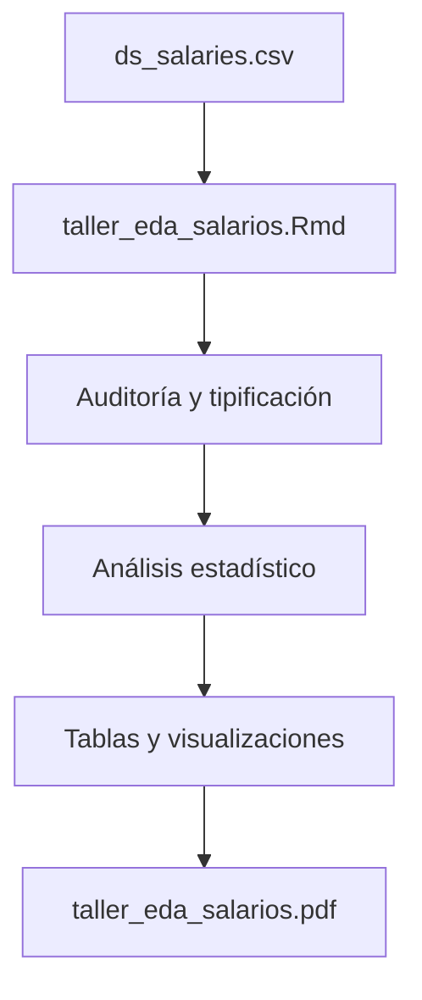

# Análisis exploratorio de salarios en Ciencia de Datos e IA

Análisis exploratorio de datos (EDA) desarrollado en R para estudiar la distribución de salarios de profesionales de Ciencia de Datos e Inteligencia Artificial.

> Proyecto académico de Estadística Descriptiva · **Autor:** David Mauricio Vargas Ramirez · **Código:** 824144

## Descripción

El análisis utiliza `ds_salaries.csv`, un conjunto de **607 registros** correspondientes al periodo **2020–2022**. Se estudia cómo varía el salario anual según el nivel de experiencia y otras características de los trabajadores y las empresas.

Variables principales:

| Variable | Descripción |
| --- | --- |
| `experience_level` | Nivel de experiencia: EN, MI, SE o EX. |
| `company_size` | Tamaño de la empresa: pequeña, mediana o grande. |
| `salary_in_usd` | Salario anual expresado en dólares estadounidenses. |
| `remote_ratio` | Proporción de trabajo remoto: 0%, 50% o 100%. |

## Arquitectura del proyecto



## Objetivos

- Auditar y tipificar las variables del conjunto de datos.
- Describir la distribución de los registros por tamaño de empresa.
- Calcular medidas de tendencia central, dispersión y forma.
- Comparar los salarios entre niveles de experiencia.
- Construir tablas de frecuencia, cuantiles y visualizaciones.
- Estimar qué proporción de perfiles `EN` alcanza al menos USD 80.000.

## Resultados destacados

- Las empresas medianas representan el **53,71%** de la muestra (326 registros).
- Los salarios tienden a aumentar a medida que crece el nivel de experiencia.
- La distribución salarial presenta asimetría positiva por la presencia de salarios altos.
- Aproximadamente el **31,8%** de los perfiles `EN` alcanza o supera los **USD 80.000**.
- El informe incluye medidas descriptivas por nivel de experiencia, tablas de frecuencia, boxplots, histograma y gráfico Q-Q.

Estos resultados describen únicamente la muestra analizada; no representan una estimación exacta del mercado laboral mundial.

## Estructura de archivos

```text
.
├── README.md
└── primerTallerR/
    ├── data/
    │   └── ds_salaries.csv
    ├── primerTallerR.Rproj
    ├── taller_eda_salarios.Rmd
    └── taller_eda_salarios.pdf
```

## Tecnologías y paquetes

- [R](https://www.r-project.org/) y [R Markdown](https://rmarkdown.rstudio.com/)
- RStudio
- LaTeX con `xelatex` para generar el PDF
- `dplyr` y `ggplot2` para manipulación y visualización
- `knitr` para tablas y generación del informe
- `e1071` para medidas estadísticas
- `scales` para formatear valores y gráficos

## Cómo ejecutar el proyecto

### 1. Instalar los paquetes

Desde R:

```r
install.packages(c(
  "dplyr", "ggplot2", "knitr", "e1071", "scales", "rmarkdown"
))
```

También es necesario contar con una distribución de LaTeX compatible con `xelatex`.

### 2. Abrir el proyecto

Abre [primerTallerR/primerTallerR.Rproj](primerTallerR/primerTallerR.Rproj) en RStudio. El archivo CSV debe permanecer en [primerTallerR/data/ds_salaries.csv](primerTallerR/data/ds_salaries.csv).

### 3. Generar el informe

Abre [primerTallerR/taller_eda_salarios.Rmd](primerTallerR/taller_eda_salarios.Rmd) y selecciona **Knit** para generar el PDF. Desde la consola de R también puedes ejecutar:

```r
setwd("primerTallerR")
rmarkdown::render("taller_eda_salarios.Rmd")
```

## Contenido estadístico

El informe aplica conceptos de estadística descriptiva, variables cualitativas y cuantitativas, escalas de medición, frecuencias absolutas y relativas, media, mediana, desviación estándar, rango intercuartílico, coeficiente de variación, asimetría, cuartiles, percentiles, boxplots, histogramas y gráficos Q-Q.

## Limitaciones

- El conjunto de datos cubre únicamente el periodo 2020–2022.
- Los salarios dependen del país y no se ajustan por costo de vida.
- La composición de la muestra puede introducir sesgos y sobrerrepresentar algunas categorías.
- La asociación entre experiencia y salario no implica causalidad.
